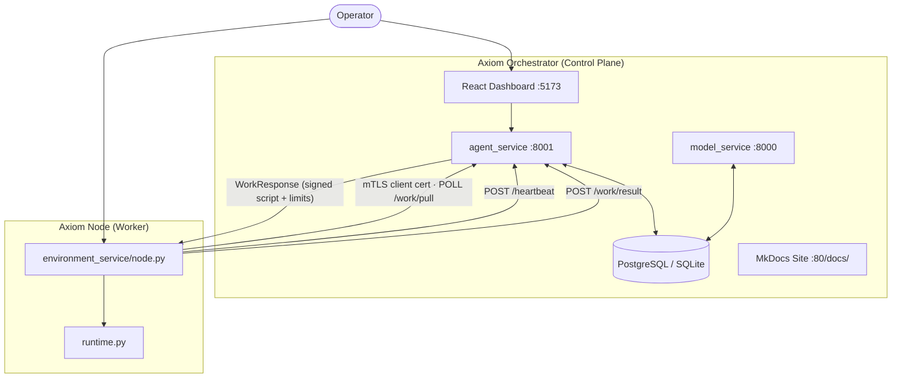
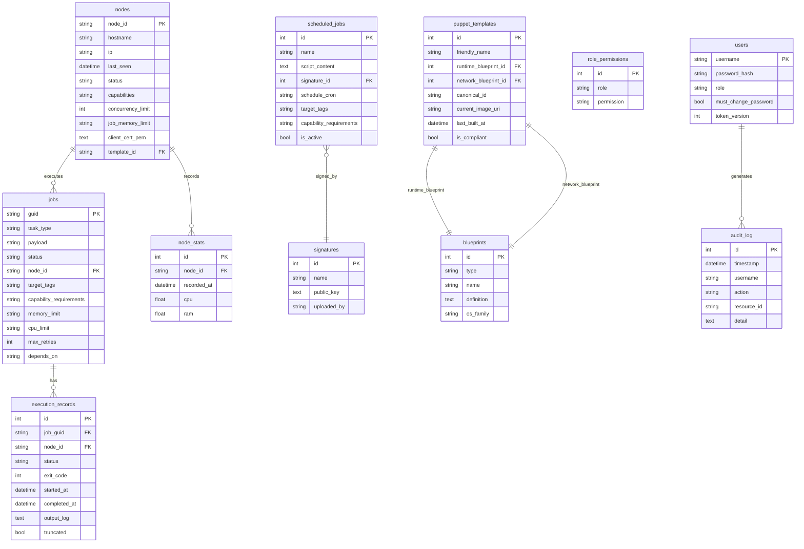
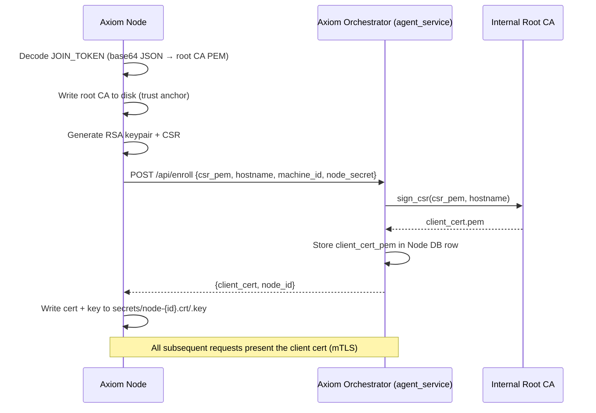
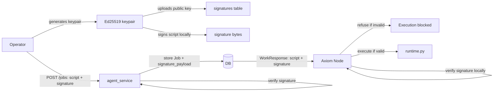
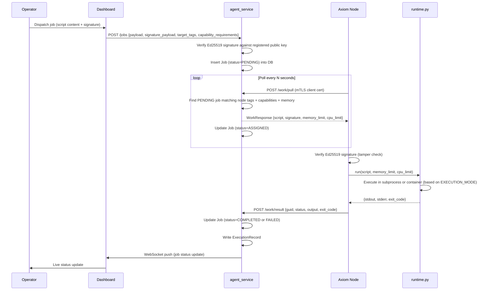
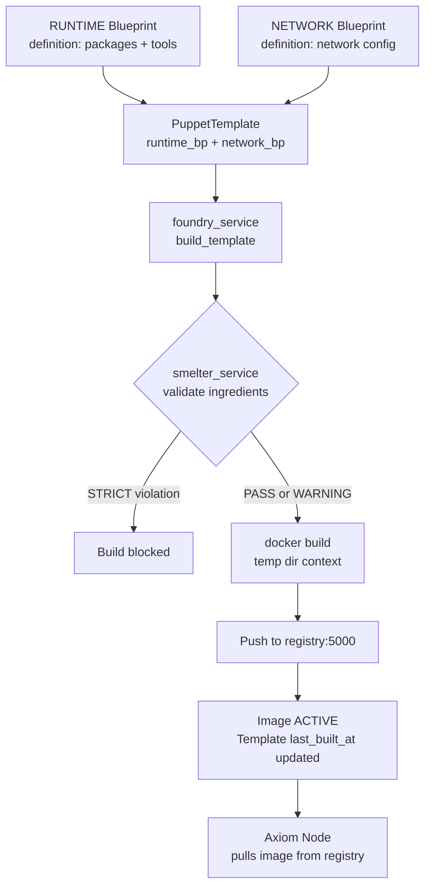
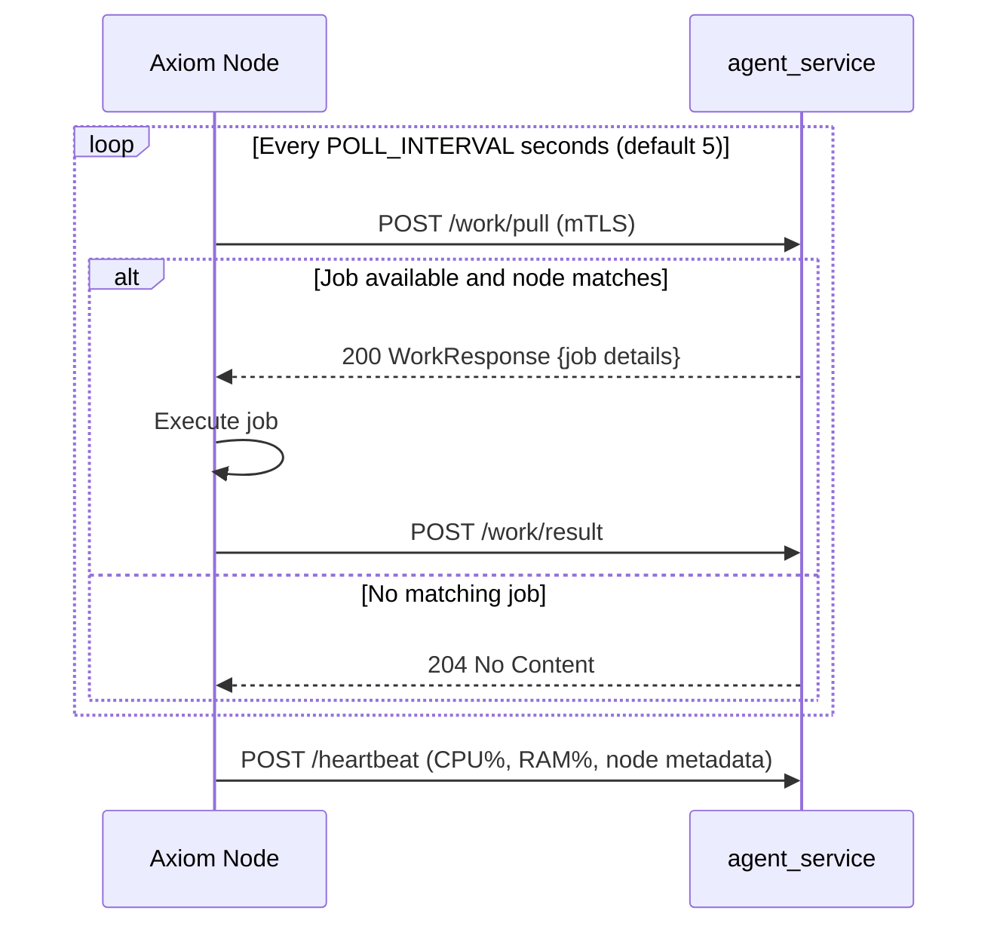

# Architecture

Axiom is a distributed job orchestration platform built around a central control plane (the **Axiom Orchestrator**) and any number of stateless worker agents (the **Axiom Nodes**). This guide is a full technical deep-dive: it covers every service, the database schema, the security model, and the data flows that make jobs run reliably across a fleet of nodes — without weakening the trust model.

The platform is designed for environments where nodes cannot accept inbound connections. A **pull model** means every node initiates all communication outward to the orchestrator; no inbound firewall rules are ever required on a node.

---

## System Overview



Three components run in every deployment:

| Component | Location | Responsibility |
|-----------|----------|---------------|
| **Axiom Orchestrator** | `puppeteer/` | All state, API, scheduling, PKI, security enforcement |
| **Axiom Node** | `puppets/environment_service/` | Stateless job executor; polls for work, runs scripts, reports results |
| **React Dashboard** | `puppeteer/dashboard/` | Web UI for operators and admins |

---

## Service Inventory

The Axiom Orchestrator is composed of two FastAPI applications and a set of service modules that handle distinct concerns.

### Top-Level Applications

| Service | Port | File | Role |
|---------|------|------|------|
| `agent_service` | 8001 | `puppeteer/agent_service/main.py` | Primary control plane — all API routes, WebSocket, PKI, job dispatch |
| `model_service` | 8000 | `puppeteer/model_service/main.py` | APScheduler-backed cron scheduling; fires job definitions on a cron schedule |

`agent_service` handles every interaction from the dashboard, nodes, and external integrations. `model_service` runs as a separate process and is responsible only for triggering scheduled jobs — it calls `agent_service` to dispatch them.

### Service Modules (`puppeteer/agent_service/services/`)

#### job_service

The core of the job dispatch pipeline. Responsibilities:

- **Node selection**: given a pending job, find the best available node by matching `target_tags` (JSON tag set), `capability_requirements`, and `memory_limit` against each node's `capabilities` and `job_memory_limit`. Nodes that cannot satisfy the requirements are skipped.
- **Job assignment**: sets `Job.node_id`, updates status to `ASSIGNED`, and the node picks it up on the next poll.
- **Heartbeat processing**: updates `Node.last_seen`, inserts a `NodeStats` row for the CPU/RAM snapshot, prunes old stats rows (keeps last 60 per node).
- **Execution records**: writes an `ExecutionRecord` for every job run (stdout, stderr, exit code, timing).

#### foundry_service

Builds custom Docker images for Axiom Nodes. The build pipeline:

1. Reads a `PuppetTemplate` (which references a RUNTIME blueprint and a NETWORK blueprint).
2. Copies `puppets/environment_service/` into a temporary directory.
3. Generates a `Dockerfile` from the `capability_matrix` injection recipes for each capability declared in the RUNTIME blueprint.
4. Runs `docker build` via the mounted Docker socket.
5. Optionally pushes the image to the local registry (`registry:5000`).
6. Updates `PuppetTemplate.last_built_at` and `PuppetTemplate.current_image_uri` on success.

A semaphore limits concurrent builds to 2. `smelter_service` validates all blueprints before the build starts.

#### scheduler_service

Wraps APScheduler (`AsyncIOScheduler`) to manage cron job definitions:

- CRUD for `ScheduledJob` records.
- Adds/removes/reschedules APScheduler jobs when definitions change.
- On cron trigger, verifies the Ed25519 signature is still valid and dispatches a new `Job` via `job_service`.
- Stats pruning: periodically removes old `NodeStats` rows.

#### pki_service

Thin lifecycle helpers wrapping `pki.py`'s `CertificateAuthority`:

- `get_or_create_ca()` — initialises or loads the Root CA (RSA 4096, stored in DB `config` table).
- `sign_csr()` — signs a node's certificate signing request.
- `revoke_node()` — adds the node's cert serial to `RevokedCert` and regenerates the CRL.
- `get_crl_pem()` — returns the current signed CRL.

#### signature_service

Manages Ed25519 public keys used to sign job scripts:

- Stores public keys (PEM format) in the `signatures` table.
- `verify_signature(public_key_id, script_bytes, signature_bytes)` — returns `True`/`False`.
- Nodes independently verify signatures before executing any script.

#### smelter_service

The security gatekeeper for Foundry builds:

- Maintains the `approved_ingredients` table — an allowlist of packages, versions, and SHA-256 hashes.
- Validates every package in a blueprint's `definition` against the allowlist before a build proceeds.
- Two enforcement modes: **STRICT** (build fails on any violation) and **WARNING** (violations logged, build continues).
- Integrates with `mirror_service` to confirm packages are available from the local PyPI/APT mirror.

#### vault_service

Binary artifact storage for Foundry capability injection files:

- Stores arbitrary binary blobs in the `artifacts` table with a SHA-256 content hash.
- Used by `capability_matrix` to reference pre-built tool binaries injected into node images during build.

#### alert_service

Generates internal alerts for security and operational events:

- Job failure after maximum retries.
- Node offline (heartbeat timeout exceeded).
- Script tamper detection (signature mismatch at node execution time).
- Writes to the `alerts` table; acknowledged by operators via the dashboard.

#### webhook_service

Outbound HMAC-signed webhook delivery:

- Reads `webhooks` table entries (URL, HMAC secret, event filter list).
- Signs every outbound payload with HMAC-SHA256 using the configured secret.
- Delivers asynchronously; retries on failure.

#### trigger_service

Inbound webhook-triggered job dispatch:

- Each `Trigger` record has a unique `slug` and a `secret_token`.
- `POST /triggers/{slug}` validates the token and dispatches the associated job definition.
- Enables CI/CD pipelines and external systems to fire scheduled jobs on demand.

#### mirror_service

Local package mirror management for air-gap builds:

- Manages the `pypi` (pypiserver) and `mirror` (APT proxy) services.
- Tracks which packages are mirrored and whether they are current.
- Smelter checks mirror availability before approving a build.

#### staging_service

A review gate for job definitions before they are activated:

- Job definitions can be submitted to a staging queue (`STAGED` state) rather than dispatched directly.
- An approver promotes a staged definition to active via a separate approval endpoint.
- Provides an audit trail of who approved what and when.

---

## Database Schema

The schema is managed by `SQLAlchemy`'s `Base.metadata.create_all` at startup. There is no Alembic — see the [Contributing guide](contributing.md) for the migration pattern.



### Key Table Notes

| Table | Notes |
|-------|-------|
| `jobs` | `status` values: `PENDING`, `ASSIGNED`, `RUNNING`, `COMPLETED`, `FAILED`, `RETRYING`. `depends_on` is a JSON array of guids. |
| `nodes` | `status` values: `ONLINE`, `OFFLINE`, `REVOKED`. `capabilities` is a JSON object (e.g., `{"python": true, "docker": true}`). |
| `node_stats` | Pruned to last 60 rows per node by `scheduler_service`. Used for sparkline charts in the dashboard. |
| `role_permissions` | Has a `UniqueConstraint(role, permission)`. Admin role bypasses this table entirely — it has an unconditional bypass in `require_permission()`. |
| `blueprints` | `type` is `RUNTIME` (defines packages/tools) or `NETWORK` (defines network configuration). `definition` is a JSON object; package lists use `{"python": [...]}` dict format. |
| `audit_log` | All security-relevant events are written here: logins, permission changes, job dispatches, node enrollments, revocations. |
| `revoked_certs` | Backing store for the CRL. Checked at every `/work/pull` and `/api/enroll` request. |
| `config` | Key-value store for system state: Root CA PEM, base image staleness markers, system settings. |

---

## Security Model

Axiom has five layered security mechanisms. Each addresses a different threat vector.

### mTLS — Mutual TLS Node Authentication

Every node-to-orchestrator connection is mutually authenticated with TLS client certificates. The orchestrator operates an internal Root CA (`pki.py`). Nodes never connect over plain HTTP.

**Enrollment flow:**



**Cert lifecycle:**

- `JOIN_TOKEN` is a base64-encoded JSON object containing the Root CA PEM. It is the only credential a node needs to bootstrap.
- After enrollment, the node stores its cert+key in `secrets/node-{id}.crt` and `secrets/node-{id}.key`. On restart, it scans for these files and reuses the existing node ID — preventing re-enrollment churn.
- Revoked certs are tracked in the `revoked_certs` table. Revoked nodes receive 403 on `/work/pull` and `/api/enroll`.
- The current CRL is served at `GET /system/crl.pem` (no auth required — needed by TLS clients).

### Ed25519 Script Signing Chain

All job scripts must be signed with an Ed25519 private key whose corresponding public key is registered in the `signatures` table. This prevents an attacker who compromises the orchestrator database from pushing arbitrary scripts to nodes.

**The signing chain:**



- Operators generate Ed25519 keypairs using `admin_signer.py` (or any standard tool).
- The public key is registered via the dashboard or `POST /signatures`.
- The operator signs each script offline before dispatching. The signature is stored in `Job.signature_payload`.
- Nodes re-verify the signature at execution time using the registered public key. If verification fails, the script is not executed and a tamper alert is generated.

### JWT + Token Versioning

The dashboard and API use JWT bearer tokens for human user authentication.

- Tokens are signed with `SECRET_KEY` (HS256).
- Every token embeds a `tv` (token version) field matching `User.token_version`.
- On any password change, `token_version` is incremented. All previously issued tokens become invalid immediately — no revocation list or session store required.
- The `must_change_password` flag forces a password reset dialog on next login before any other UI is accessible.
- Token expiry is 24 hours by default.

!!! warning "Production requirement"
    Always set `SECRET_KEY` to a cryptographically random value in production. The default is a weak development placeholder. Use `openssl rand -hex 32`.

### RBAC — Role-Based Access Control

Three roles exist: `admin`, `operator`, `viewer`. Permissions are stored in the `role_permissions` table and seeded at startup.

| Role | Typical Permissions | Notes |
|------|--------------------|----|
| `admin` | All | Bypasses all permission checks — checked inline in `require_permission()` |
| `operator` | `jobs:write`, `nodes:write`, `foundry:write`, `signatures:write` | Can dispatch jobs, manage nodes, manage Foundry |
| `viewer` | `jobs:read`, `nodes:read`, `audit:read` | Read-only dashboard access |

Route protection pattern (from `main.py`):

```python
async def some_route(current_user = Depends(require_permission("jobs:write"))):
    ...
```

`require_permission()` is a factory that returns a FastAPI dependency. Admin users skip the DB lookup. All other users are checked against `role_permissions`.

Node-facing endpoints (`/api/enroll`, `/work/pull`, `/heartbeat`, `/work/result`) are **unauthenticated** — they rely on mTLS client certificates only.

### Fernet Encryption at Rest

Sensitive job payloads and secrets stored in the database are encrypted using Fernet (AES-128-CBC with HMAC-SHA256).

- The `ENCRYPTION_KEY` environment variable must hold a valid Fernet key.
- Encryption and decryption are handled in `security.py` via `fernet_encrypt()` and `fernet_decrypt()`.
- If `ENCRYPTION_KEY` is not set, the service will auto-generate one at startup — but this key is lost on restart, making all previously encrypted data unreadable. **Always set `ENCRYPTION_KEY` explicitly in production.**

!!! tip "Generating a Fernet key"
    ```bash
    python -c "from cryptography.fernet import Fernet; print(Fernet.generate_key().decode())"
    ```

---

## Job Execution Data Flow

The sequence from operator action to completed job result:



**Key decision points in the flow:**

- If the node's Ed25519 verification fails, the script is not executed and a tamper alert is generated. The job is marked `FAILED`.
- If `max_retries` is set and the job fails, it re-enters `PENDING` and is reassigned on the next poll cycle.
- `depends_on` (JSON array of job guids) — jobs are not dispatched until all dependencies are `COMPLETED`.
- Memory admission: if a node's `job_memory_limit` is lower than the job's `memory_limit`, the node is skipped during selection.

---

## Foundry & Smelter

Foundry builds custom Docker images for Axiom Nodes. Smelter is the security gatekeeper that validates every ingredient before a build proceeds.

### Build Pipeline



### Blueprint Model

Blueprints are reusable build ingredients. Two types:

| Type | Purpose | Definition Format |
|------|---------|-----------------|
| `RUNTIME` | Declares packages, tools, and capabilities installed in the image | `{"python": ["requests", "boto3"], "system": ["curl"]}` |
| `NETWORK` | Declares network configuration (proxy settings, DNS, etc.) | JSON network config object |

Each blueprint has an `os_family` field (`DEBIAN` or `ALPINE`) that selects the appropriate injection recipe from `capability_matrix`.

### Template → Image Build

A `PuppetTemplate` combines one RUNTIME blueprint and one NETWORK blueprint. When built, the orchestrator:

1. `foundry_service` copies `puppets/environment_service/` to a temporary directory.
2. For each capability in the RUNTIME blueprint, the matching `capability_matrix` row provides a Dockerfile snippet (`injection_recipe`) that installs the capability.
3. A complete `Dockerfile` is assembled and `docker build` is invoked.
4. The resulting image is tagged and pushed to the local registry at `localhost:5000`.

### Smelter Enforcement

The `approved_ingredients` table is the security allowlist for Foundry builds. Before any build:

- Every package in every blueprint is checked against `approved_ingredients` (name, version constraint, SHA-256).
- In **STRICT** mode: any package not in the allowlist causes an immediate build failure.
- In **WARNING** mode: violations are logged and the build proceeds.
- The enforcement mode is set in the system `config` table.

### Image Lifecycle

| State | Meaning |
|-------|---------|
| `ACTIVE` | Currently built; nodes can use this image |
| `DEPRECATED` | Superseded by a newer build; nodes should upgrade |
| `REVOKED` | Security issue; nodes must not use this image |

The dashboard shows a staleness warning when the base OS image has been updated but a template has not been rebuilt since the update.

---

## Pull Model Architecture

All node-to-orchestrator communication is initiated by the node. This is a deliberate architectural decision.

**Why pull, not push?**

In a push model, the orchestrator would need to open a connection to each node to deliver work. This requires:

- The orchestrator to know the node's current IP address.
- Inbound firewall rules on every node to accept connections from the orchestrator.
- Network infrastructure that routes the orchestrator's traffic to every node (VLANs, VPNs, etc.).

In the pull model, nodes only need outbound HTTPS connectivity to the orchestrator's address. This works:

- Behind NAT, without port forwarding.
- In cloud environments where nodes have no stable public IP.
- Across network boundaries where inbound rules are locked down.
- With ephemeral nodes (containers, spot instances) that come and go.

**How the pull loop works:**



**Heartbeat cadence:** Nodes send heartbeats independently of the work poll. If a node's `last_seen` timestamp exceeds the offline threshold (configurable), `job_service` marks the node `OFFLINE` and generates an alert. Any jobs assigned to that node are re-queued.

**WorkResponse payload:**

```python
class WorkResponse(BaseModel):
    guid: str           # Job identifier
    task_type: str      # Informational job type label
    payload: str        # Script content (plaintext Python)
    signature_payload: str  # Base64-encoded Ed25519 signature
    memory_limit: str | None
    cpu_limit: str | None
```

The node receives the script content and the signature in a single response. It must verify the signature before passing the script to `runtime.py`. There is no mechanism to execute a script without a valid registered signature.

!!! note "Node identity persistence"
    Node IDs are stable across container restarts. On startup, `node.py` scans the `secrets/` directory for an existing `node-{id}.crt` file. If found, that node ID is reused — preventing re-enrollment on every restart. The `secrets/` directory should be a persistent Docker volume in any production deployment.

---

## Environment Variables Reference

| Variable | Service | Required? | Purpose |
|----------|---------|-----------|---------|
| `SECRET_KEY` | agent_service | Recommended | JWT signing key — use a strong random value |
| `ENCRYPTION_KEY` | agent_service | Required | Fernet key for secrets at rest — must be stable |
| `ADMIN_PASSWORD` | agent_service | Recommended | Initial admin password (random if unset, logged) |
| `API_KEY` | agent_service | **Required** | Shared API key — `sys.exit(1)` at import if missing |
| `DATABASE_URL` | agent_service, model_service | Optional | Defaults to SQLite (`jobs.db`). Use `postgresql+asyncpg://...` for production |
| `AGENT_URL` | model_service, nodes | Required for nodes | URL nodes use to reach agent_service (e.g., `https://192.168.1.10:8001`) |
| `JOIN_TOKEN` | nodes | Required | Base64 JSON containing Root CA PEM; generated by the dashboard |
| `EXECUTION_MODE` | nodes | Optional | `auto` (default), `direct`, `docker`, or `podman`. Use `direct` inside Docker-in-Docker |
| `JOB_MEMORY_LIMIT` | nodes | Optional | Default memory limit for all jobs on this node (e.g., `512m`) |
| `JOB_CPU_LIMIT` | nodes | Optional | Default CPU limit for all jobs on this node (e.g., `1.0`) |

!!! warning "API_KEY is mandatory"
    `security.py` calls `sys.exit(1)` at module import time if `API_KEY` is not set. This will prevent `agent_service` from starting at all. Always set it — even for local development (`export API_KEY=dev-key` is sufficient).
