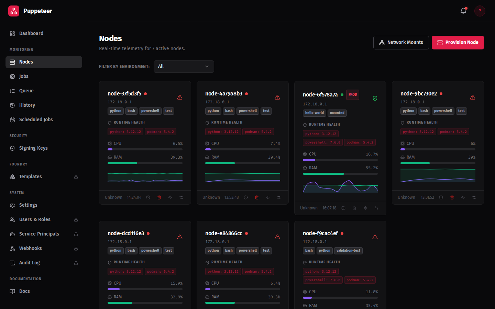
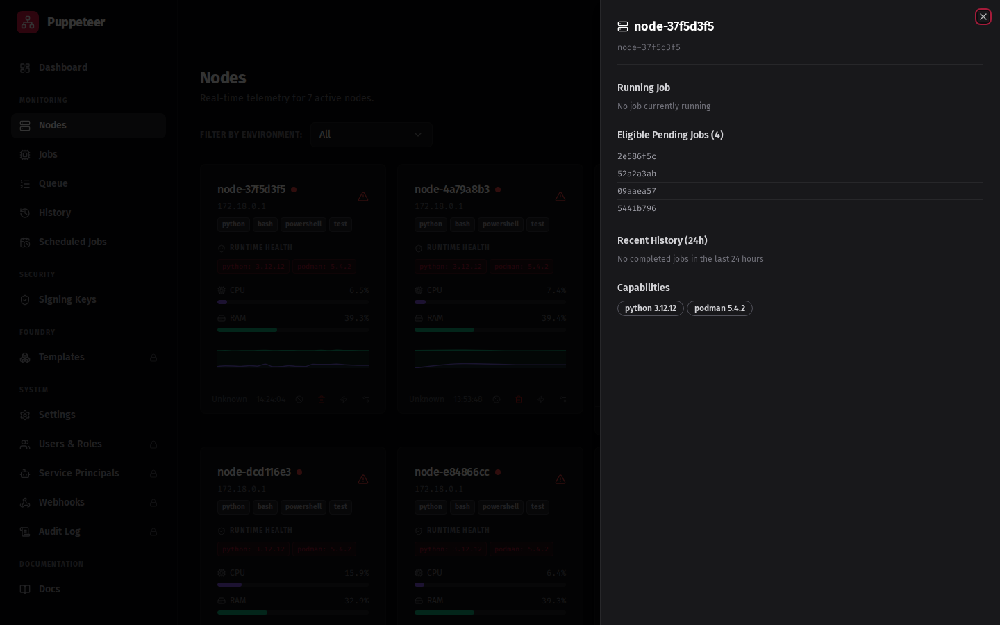

# Enroll a Node

Nodes self-enroll over mTLS — they generate a certificate signing request and get a signed client cert from the control plane. You provide a JOIN_TOKEN that embeds the Root CA so the node can establish trust automatically.

---

## Step 1: Generate an enrollment token

=== "Dashboard"

    1. In the dashboard, go to **Nodes**
    2. Click **Generate Token**
    3. Click **Copy JOIN_TOKEN** — this copies the enhanced token (base64-encoded JSON with the Root CA embedded)

    !!! warning "Use the dashboard Copy button"
        The raw API endpoint `POST /api/enrollment-tokens` returns only the token hex string. The **enhanced JOIN_TOKEN** — which includes the Root CA for mTLS bootstrap — is only available via the dashboard **Copy JOIN_TOKEN** button.

        If you give the node the raw hex string, you will see the node failing with a TLS error rather than the expected log line:
        ```
        Detected Enhanced Token. Bootstrapping Trust...
        ```

        **Always copy the JOIN_TOKEN from the dashboard.**

=== "CLI"

    Log in to get a JWT:

    ```bash
    TOKEN=$(curl -sk -X POST https://<your-orchestrator>:8001/auth/login \
      -H 'Content-Type: application/x-www-form-urlencoded' \
      -d 'username=admin&password=<your-password>' | python3 -c "import sys,json; print(json.load(sys.stdin)['access_token'])")
    ```

    Then generate and retrieve the enhanced token:

    ```bash
    curl -sk -X POST https://<your-orchestrator>:8001/admin/generate-token \
      -H "Authorization: Bearer $TOKEN" \
      | python3 -c "import sys,json; d=json.load(sys.stdin); print(d['token'])"
    ```

    The `token` field contains the full base64-encoded JOIN_TOKEN with the Root CA embedded.

=== "Windows (PowerShell)"

    Log in to get a JWT. PowerShell's `Invoke-RestMethod` requires TLS validation to be disabled for self-signed certificates:

    ```powershell
    # Disable TLS validation for self-signed cert
    add-type @"
        using System.Net;
        using System.Security.Cryptography.X509Certificates;
        public class TrustAll : ICertificatePolicy {
            public bool CheckValidationResult(ServicePoint sp, X509Certificate cert, WebRequest req, int problem) { return true; }
        }
    "@
    [System.Net.ServicePointManager]::CertificatePolicy = New-Object TrustAll

    $response = Invoke-RestMethod -Method POST `
        -Uri "https://<your-orchestrator>:8001/auth/login" `
        -ContentType "application/x-www-form-urlencoded" `
        -Body "username=admin&password=<your-password>"
    $TOKEN = $response.access_token
    ```

    Then generate and retrieve the enhanced token:

    ```powershell
    $tokenResponse = Invoke-RestMethod -Method POST `
        -Uri "https://<your-orchestrator>:8001/admin/generate-token" `
        -Headers @{Authorization = "Bearer $TOKEN"}
    $JOIN_TOKEN = $tokenResponse.token
    Write-Host "JOIN_TOKEN: $JOIN_TOKEN"
    ```

    The `token` field contains the full base64-encoded JOIN_TOKEN with the Root CA embedded.

!!! note "Admin password (cold-start installs)"
    If you started Axiom using `compose.cold-start.yaml`, the default login is **admin / admin**. You will be prompted to change it on first login.

---

## Step 2: Configure node connectivity

Choose the `AGENT_URL` value that matches your deployment scenario:

| Scenario | AGENT_URL |
|----------|-----------|
| Cold-start compose (node in same compose network) | `https://agent:8001` |
| Server compose, node on same host | `https://puppeteer-agent-1:8001` |
| Remote host / separate machine | `https://<hostname-or-ip>:8001` |
| Docker Desktop (Mac or Windows) | `https://host.docker.internal:8001` |

If your node is on a custom Linux bridge network, find the gateway with:

```bash
ip route | awk '/default/ {print $3}'
```

---

## Step 3: Install the node

=== "Option A: curl installer"

    The one-liner downloads and runs the universal installer script hosted on the orchestrator:

    ```bash
    curl -sSL https://<your-orchestrator>/installer.sh | bash -s -- --token "<JOIN_TOKEN>"
    ```

    Replace `<your-orchestrator>` with your orchestrator's hostname or IP (e.g., `10.0.0.5:8001` or `my-orchestrator.example.com`).

    The installer script:

    - Detects Docker or Podman on your system
    - Downloads a ready-to-run `node-compose.yaml` from the orchestrator
    - Starts the node container automatically

    !!! tip "Getting the compose file without running it"
        The orchestrator also serves the generated compose file directly if you want to inspect or customise it before running:
        ```bash
        curl -sSL "https://<your-orchestrator>/api/installer/compose?token=<JOIN_TOKEN>" > node-compose.yaml
        docker compose -f node-compose.yaml up -d
        ```

=== "Option B: Docker Compose (Linux / macOS)"

    For full control over the configuration, create the compose file manually.

    Create `node-compose.yaml` with the following content, substituting your JOIN_TOKEN and AGENT_URL:

    ```yaml
    services:
      puppet-node:
        image: ghcr.io/axiom-laboratories/axiom-node:latest
        environment:
          NODE_TAGS: general,linux
          JOB_IMAGE: docker.io/library/python:3.12-alpine
          AGENT_URL: https://agent:8001
          JOIN_TOKEN: <paste-your-enhanced-token-here>
          ROOT_CA_PATH: /app/secrets/root_ca.crt
          EXECUTION_MODE: docker
        volumes:
          - node-secrets:/app/secrets
          - /var/run/docker.sock:/var/run/docker.sock
        networks:
          - axiom_default

    volumes:
      node-secrets:

    networks:
      axiom_default:
        external: true
    ```

    !!! note "Network name"
        The `axiom_default` network is created automatically when you run `compose.cold-start.yaml`.
        The network name is derived from the directory you placed the compose file in — if the file is
        in a directory other than the default, you may see a different prefix. Run
        `docker network ls | grep default` to find the exact name and update `axiom_default` accordingly.

    !!! tip "EXECUTION_MODE=docker"
        When the node container runs inside Docker, set `EXECUTION_MODE=docker`. This tells the node to spawn job containers using the host's Docker daemon via the mounted socket (`/var/run/docker.sock`).

        You must also add the Docker socket to the node's volumes:

        ```yaml
        volumes:
          - node-secrets:/app/secrets
          - /var/run/docker.sock:/var/run/docker.sock
        ```

        Then update your compose to mount the socket:

        ```yaml
        services:
          puppet-node:
            image: ghcr.io/axiom-laboratories/axiom-node:latest
            environment:
              ...
              AGENT_URL: https://agent:8001
              EXECUTION_MODE: docker
            volumes:
              - node-secrets:/app/secrets
              - /var/run/docker.sock:/var/run/docker.sock
            networks:
              - axiom_default
        networks:
          axiom_default:
            external: true
        ```

    Then start the node:

    ```bash
    docker compose -f node-compose.yaml up -d
    ```

=== "Option B: Docker Compose (Windows (PowerShell))"

    For full control over the configuration, create the compose file manually.

    Create `node-compose.yaml` with the following content, substituting your JOIN_TOKEN and AGENT_URL. On Windows with Docker Desktop, use `host.docker.internal` as the gateway — see the connectivity table in Step 2.

    ```yaml
    services:
      puppet-node:
        image: localhost/master-of-puppets-node:latest
        environment:
          NODE_TAGS: general,windows
          JOB_IMAGE: docker.io/library/python:3.12-alpine
          AGENT_URL: https://host.docker.internal:8001
          JOIN_TOKEN: <paste-your-enhanced-token-here>
          ROOT_CA_PATH: /app/secrets/root_ca.crt
          EXECUTION_MODE: docker
          DOCKER_HOST: npipe:////./pipe/docker_engine
        volumes:
          - node-secrets:/app/secrets
          - //./pipe/docker_engine://./pipe/docker_engine

    volumes:
      node-secrets:
    ```

    !!! tip "Windows Docker socket path"
        On Windows, Docker Desktop uses a named pipe instead of a Unix socket. The volume mapping `//./pipe/docker_engine://./pipe/docker_engine` and `DOCKER_HOST: npipe:////./pipe/docker_engine` are required so the node container can reach the host Docker daemon.

    Then start the node (the `docker compose` command works identically in PowerShell):

    ```powershell
    docker compose -f node-compose.yaml up -d
    ```

---

## Step 4: Verify enrollment

Check the node logs:

```bash
docker compose -f node-compose.yaml logs -f
```

On successful enrollment you should see:

```
Detected Enhanced Token. Bootstrapping Trust...
Node enrolled successfully
```

Then check the dashboard — go to **Nodes** and the node should appear with status **ONLINE** within 30 seconds as it begins sending heartbeats.

---

## What the Nodes view looks like

Once your node is enrolled and sending heartbeats, the **Nodes** page shows live status:



Click any node row to open the node detail drawer with capability information, stats history, and enrollment details:



---

**Next:** [First Job →](first-job.md)
