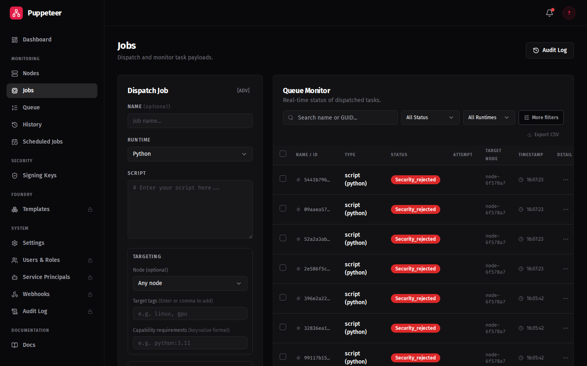
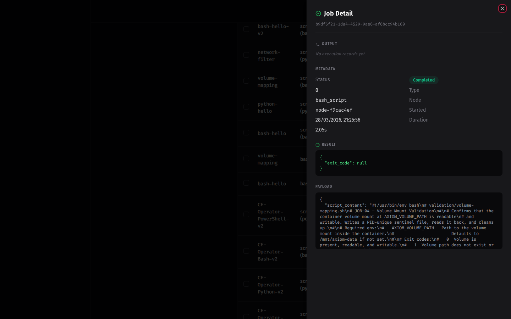

# Your First Job

Jobs are Python scripts signed with an Ed25519 private key. The node verifies the signature
before executing. This guide walks through generating a signing key, registering the public key,
and dispatching your first job.

---

## Step 0: Generate a signing keypair

Every job must be signed before dispatch. Generate a keypair once — the private key stays on your machine, the public key gets registered in Axiom.

=== "Python (cryptography)"

    ```bash
    python3 - <<'EOF'
    from cryptography.hazmat.primitives.asymmetric.ed25519 import Ed25519PrivateKey
    from cryptography.hazmat.primitives import serialization

    key = Ed25519PrivateKey.generate()

    with open("signing.key", "wb") as f:
        f.write(key.private_bytes(
            serialization.Encoding.PEM,
            serialization.PrivateFormat.PKCS8,
            serialization.NoEncryption()
        ))

    with open("verification.key", "wb") as f:
        f.write(key.public_key().public_bytes(
            serialization.Encoding.PEM,
            serialization.PublicFormat.SubjectPublicKeyInfo
        ))

    print("Done. Upload verification.key to Axiom, keep signing.key private.")
    EOF
    ```

=== "openssl"

    ```bash
    openssl genpkey -algorithm ed25519 -out signing.key
    openssl pkey -in signing.key -pubout -out verification.key
    ```

=== "Windows (PowerShell)"

    PowerShell does not support bash heredocs. Save the key generation script to a file first, then run it:

    ```powershell
    $script = @'
    from cryptography.hazmat.primitives.asymmetric.ed25519 import Ed25519PrivateKey
    from cryptography.hazmat.primitives import serialization

    key = Ed25519PrivateKey.generate()

    with open("signing.key", "wb") as f:
        f.write(key.private_bytes(
            serialization.Encoding.PEM,
            serialization.PrivateFormat.PKCS8,
            serialization.NoEncryption()
        ))

    with open("verification.key", "wb") as f:
        f.write(key.public_key().public_bytes(
            serialization.Encoding.PEM,
            serialization.PublicFormat.SubjectPublicKeyInfo
        ))

    print("Done. Upload verification.key to Axiom, keep signing.key private.")
    '@
    $script | Out-File -Encoding utf8 gen_key.py
    python gen_key.py
    ```

    !!! note "cryptography library"
        If `python gen_key.py` fails with an import error, install first: `pip install cryptography`

This produces `signing.key` (private — keep safe) and `verification.key` (public — upload to Axiom).

!!! warning "Never commit signing.key"
    Store it in a secrets manager in production. Anyone who holds it can forge job signatures.

### Register the public key

1. Go to **Signatures** in the dashboard sidebar
2. Click **Register Trusted Key**
3. Paste the contents of `verification.key`, give it a name (e.g. `dev-key`), click **Establish Trust**
4. Note the **Key ID** — you'll need it when dispatching

!!! tip "Getting started banner"
    The Signatures page shows a banner with these same commands when no keys are registered yet.

---

## Quick Start (axiom-push CLI)

!!! note "axiom-push requires EE"
    `axiom-push` is an Enterprise Edition feature. CE users should skip to [Manual Setup](#manual-setup).

**Step 0: Set your server URL**

```bash
export AXIOM_URL=https://your-orchestrator:8001
```

**Step 1: Run axiom-push init**

```bash
axiom-push init
```

`init` completes three steps automatically:
1. **Login** — opens a browser for the OAuth device flow (skipped if already logged in)
2. **Key generation** — creates `~/.axiom/signing.key` and `~/.axiom/verification.key`
3. **Registration** — uploads the public key to the server and prints your Key ID

On success you will see:

```
Setup complete.
Key ID: <id>

Push your first job:
  axiom-push job push --script hello.py --key ~/.axiom/signing.key --key-id <id>
```

Copy the printed command — your Key ID is already substituted in.

??? tip "Generate a keypair without running init (standalone key generation)"
    Use `axiom-push key generate` if you only want to create keys locally without logging in:

    ```bash
    axiom-push key generate
    ```

    This writes `~/.axiom/signing.key` (0600) and `~/.axiom/verification.key` to disk and
    prints the public key PEM to stdout. Use `--force` to overwrite existing keys.

    After generation, register the public key in the dashboard:
    1. Go to **Signatures** in the sidebar
    2. Click **Add Signature Key**, paste the printed PEM, give it a name, click **Save**
    3. Note the **Key ID** for use with `--key-id`

---

## Step 2: Write a test script

=== "Linux / macOS"

    Create `hello.py`:

    ```python
    print("Hello from Axiom!")
    import platform
    print(f"Running on {platform.node()} ({platform.system()})")
    ```

=== "Windows (PowerShell)"

    Create `hello.py` (Python works on all nodes — recommended for the CE getting started path):

    ```powershell
    @'
    print("Hello from Axiom!")
    import platform
    print(f"Running on {platform.node()} ({platform.system()})")
    '@ | Out-File -Encoding utf8 hello.py
    ```

    Alternatively, create a PowerShell script `hello.ps1` for use on Windows-capable nodes:

    ```powershell
    @'
    Write-Host "Hello from Axiom on Windows!"
    Write-Host "Running on $env:COMPUTERNAME"
    '@ | Out-File -Encoding utf8 hello.ps1
    ```

    !!! note "PowerShell scripts on nodes"
        The node's job runner executes the script content via Python subprocess. PowerShell scripts work when the node image has `pwsh` in PATH. The default CE node image uses Python — use `hello.py` (Python) for CE. For Windows-capable nodes, PowerShell scripts run as expected.

        **For this Getting Started guide**, use `hello.py` — it works on all nodes. The PowerShell signing path below works with any script file.

---

## Step 3: Dispatch the job

=== "CLI (axiom-push)"

    ```bash
    axiom-push job push \
      --script hello.py \
      --key ~/.axiom/signing.key \
      --key-id <your-key-id>
    ```

=== "Dashboard"

    1. Go to **Jobs** in the dashboard sidebar
    2. Click **New Job**
    3. Fill in the form:
        - **Script**: paste the contents of `hello.py`
        - **Signature**: base64-encoded signature (see Manual Setup below)
        - **Signature Key**: select the key you registered
        - **Target tags**: leave blank for any available node, or enter `general`
    4. Click **Dispatch**

---

## Step 4: Verify the result

The job appears in the Jobs list and transitions through statuses:

```
PENDING → ASSIGNED → COMPLETED
```

Click the job row to expand the result. The output should show:

```
Hello from Axiom!
Running on <node-hostname> (Linux)
```

!!! success "You've completed the Getting Started guide"
    Your node is enrolled, jobs are running, and results are captured in the dashboard.

    **What to explore next:**

    - [Foundry](../feature-guides/foundry.md) — build custom node images with pre-installed runtimes and packages
    - [axiom-push CLI](../feature-guides/axiom-push.md) — full CLI reference

## What the Jobs view looks like

The **Jobs** view shows all dispatched jobs with their current status:



Click a completed job row to open the job detail panel with output, timing, and attestation details:



---

## Manual Setup

Use this path if you do not have `axiom-push` or prefer to use `openssl` directly.

### Generate a signing keypair

```bash
openssl genpkey -algorithm ed25519 -out signing.key
openssl pkey -in signing.key -pubout -out verification.key
```

!!! warning "Keep your private key safe"
    Never commit `signing.key` to git. In production, store it in a secrets manager.

### Register the public key in the dashboard

1. Go to **Signatures** in the dashboard sidebar
2. Click **Add Signature Key**
3. Paste the contents of `verification.key` into the field
4. Give it a descriptive name (e.g., `dev-operator-key`)
5. Click **Save**
6. Note the **Key ID** — you will need it when submitting jobs

!!! danger "Register before dispatching"
    Job creation fails with a `422` signature validation error if no public key is registered.

### Sign and submit

=== "Linux / macOS"

    Set `$TOKEN` by logging in first:
    ```bash
    TOKEN=$(curl -sk -X POST https://<your-orchestrator>:8001/auth/login \
      -H 'Content-Type: application/x-www-form-urlencoded' \
      -d 'username=admin&password=<your-password>' | python3 -c "import sys,json; print(json.load(sys.stdin)['access_token'])")
    ```

    Sign and submit with curl:
    ```bash
    SIG=$(openssl pkeyutl -sign -inkey signing.key -rawin -in hello.py | base64 -w0)
    curl -sk -X POST https://<your-orchestrator>:8001/jobs \
      -H "Authorization: Bearer $TOKEN" \
      -H "Content-Type: application/json" \
      -d "{\"script_content\": \"$(cat hello.py | python3 -c 'import sys,json; print(json.dumps(sys.stdin.read()))')\", \"signature\": \"$SIG\", \"signature_id\": \"<key-id>\"}"
    ```

=== "Windows (PowerShell)"

    Set `$TOKEN` by logging in first:
    ```powershell
    # For self-signed certs, use -SkipCertificateCheck on each request below

    $response = Invoke-RestMethod -Method POST `
        -Uri "https://<your-orchestrator>:8001/auth/login" `
        -ContentType "application/x-www-form-urlencoded" `
        -Body "username=admin&password=<your-password>" `
        -SkipCertificateCheck
    $TOKEN = $response.access_token
    ```

    Sign the script using Python (the same `cryptography` library used for key generation):
    ```powershell
    $signScript = @'
    import base64, sys
    from cryptography.hazmat.primitives import serialization

    with open("signing.key", "rb") as f:
        key = serialization.load_pem_private_key(f.read(), password=None)

    with open(sys.argv[1], "rb") as f:
        script_bytes = f.read()

    sig = key.sign(script_bytes)
    print(base64.b64encode(sig).decode())
    '@
    $signScript | Out-File -Encoding utf8 sign_script.py
    $SIG = python sign_script.py hello.py
    ```

    Submit the job via `Invoke-RestMethod`:
    ```powershell
    $scriptContent = Get-Content -Raw hello.py
    $body = @{
        script_content = $scriptContent
        signature = $SIG
        signature_id = "<your-key-id>"
    } | ConvertTo-Json

    Invoke-RestMethod -Method POST `
        -Uri "https://<your-orchestrator>:8001/jobs" `
        -Headers @{Authorization = "Bearer $TOKEN"} `
        -ContentType "application/json" `
        -Body $body `
        -SkipCertificateCheck
    ```

Replace `<your-orchestrator>`, `<your-password>`, and `<your-key-id>` with your actual values.

!!! tip "Key ID format"
    The Key ID is a UUID (e.g. `550e8400-e29b-41d4-a716-446655440000`). Find it on the **Signatures** page in the dashboard after registering your public key.
