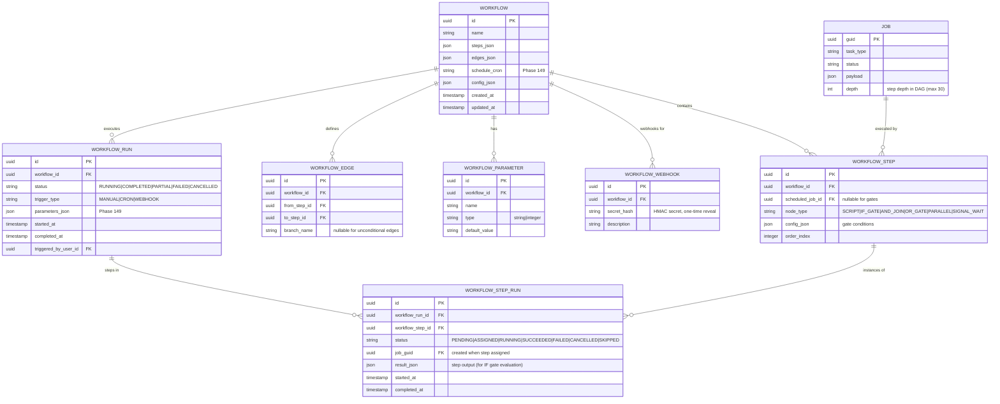

# Workflow Developer Guide

Learn the internal architecture and implementation details of the Axiom workflow engine. This guide explains the BFS dispatch algorithm, concurrency guards, cascade cancellation logic, and the system's data model. For operational guidance, see the Operator Guide.

## Architecture Overview

The workflow system is organized in three layers:

- **API Layer** (`main.py`): 14 FastAPI endpoints for CRUD, run management, webhooks, manual triggers
- **Service Layer** (`workflow_service.py`): BFS dispatch algorithm, gate evaluation, status consolidation, cascade cancellation
- **Data Layer** (`db.py`): 7 SQLAlchemy ORM tables modelling the workflow DAG and execution state

The service layer is the heart of the system; it orchestrates step dispatch, gate evaluation, and failure propagation.

## Data Model

Seven tables model the workflow DAG and execution state:



**Key relationships:**

- **WorkflowRun** tracks one execution of a Workflow instance
- **WorkflowStepRun** tracks the execution of one step within that run
- When a step is ready to dispatch, a **Job** is created with a FK to the WorkflowStepRun
- **WorkflowEdge** defines the DAG topology (from_step_id → to_step_id)
- **WorkflowParameter** defines named parameters (resolved at dispatch time, injected as env vars)

## BFS Wave Dispatch Algorithm

The dispatch algorithm is a breadth-first search through the DAG. Each "wave" consists of all steps with all dependencies complete. This ensures steps dispatch in topological order without explicit ordering.

### High-Level Flow

1. **Initialization:** All steps with zero incoming edges are marked ready for dispatch
2. **Wave loop:** While pending steps remain:
   - Identify all steps with all dependencies completed
   - Dispatch that "wave" of steps concurrently
   - Mark them ASSIGNED; poll for completion
   - On completion, update graph and identify next wave
3. **Termination:** When no pending steps remain, finalize WorkflowRun status

### Pseudocode

```
function dispatch_workflow_run(workflow_id, workflow_run_id):
    workflow = get_workflow(workflow_id)
    run = get_workflow_run(workflow_run_id)
    
    # Build dependency graph
    graph = build_graph(workflow.steps, workflow.edges)
    
    # Identify root steps (no incoming edges)
    root_steps = [s for s in workflow.steps if has_no_predecessors(s, graph)]
    
    # Dispatch root steps
    for step in root_steps:
        create_job_for_step(step, run_id)
        mark_step_as_RUNNING(step, run_id)
    
    # Wait for at least one to complete (polling loop)
    while has_pending_steps(run_id):
        poll_job_status()
        
        for completed_step in get_completed_steps():
            # Find all downstream steps ready for dispatch
            ready_steps = [s for s in get_descendants(completed_step) 
                          if all_predecessors_complete(s, run_id)]
            
            for step in ready_steps:
                if is_gate_node(step):
                    evaluate_gate(step, run_id)
                else:
                    create_job_for_step(step, run_id)
                    mark_step_as_RUNNING(step, run_id)
    
    finalize_workflow_run_status(run_id)
```

### Topological Guarantee

The algorithm respects DAG topology: a step is only dispatched when **ALL** its incoming edges have completed. This guarantees correct ordering without explicit sequencing. Multiple steps in the same wave are independent and could execute in any order.

### Implementation (workflow_service.py)

The actual implementation in `dispatch_next_wave()`:

1. Builds networkx DiGraph from edges
2. Iterates through all steps in topological order
3. For each step, checks if all predecessors are COMPLETED
4. Creates Job + marks RUNNING for SCRIPT steps; handles gates with gate-specific logic (see below)
5. Uses atomic UPDATE with CAS semantics to prevent duplicate dispatch

## Concurrency Safety: SELECT...FOR UPDATE (CAS Guards)

**Problem:** Multiple poll cycles might simultaneously detect that a step is ready to dispatch, causing duplicate Job creation.

**Solution:** Atomic row-level locks using SELECT...FOR UPDATE in the database.

### Pattern

```python
# In workflow_service.py::dispatch_next_wave()

# Atomic CAS: try to transition status PENDING→RUNNING
stmt_update = (
    update(WorkflowStepRun)
    .where(
        and_(
            WorkflowStepRun.id == sr.id,
            WorkflowStepRun.status == "PENDING"
        )
    )
    .values(status="RUNNING", started_at=datetime.utcnow())
)
result = await db.execute(stmt_update)

# If rowcount == 0, another process already claimed it — skip
if result.rowcount == 0:
    continue  # Another dispatch cycle already transitioned this step
```

### Why This Works

1. The UPDATE statement is atomic at the database level
2. Only one transaction can transition a WorkflowStepRun from PENDING→RUNNING
3. The second transaction sees rowcount == 0 (no rows matched the WHERE clause) and skips
4. This prevents duplicate Job creation under concurrent load

### Impact

This pattern ensures that if two poll cycles run simultaneously, only one will succeed in creating the Job. The second will re-check and see the step is already RUNNING, skipping duplicate creation. This is critical for correctness under concurrent load (multiple dispatch threads polling the same workflow).

## Gate Node Handling

Gates do not create jobs; they control flow topology. Each gate type has specific dispatch logic:

### IF_GATE

Evaluates conditions against the predecessor's `result_json`. If ALL conditions match, routes to the primary branch. If any condition fails, routes to the failure branch. Only one branch is taken.

```python
# In gate_evaluation_service.py::evaluate_if_gate()
def evaluate_if_gate(conditions: dict, result: dict) -> Tuple[Optional[str], Optional[str]]:
    """
    Evaluate IF gate conditions against step result.
    Returns (branch_taken, error).
    """
    for condition in conditions.get("conditions", []):
        operator = condition["operator"]  # "eq", "contains", "gt", etc.
        path = condition["path"]  # JSONPath into result
        expected_value = condition["value"]
        
        actual_value = get_json_path(result, path)
        if not evaluate_operator(operator, actual_value, expected_value):
            # Condition failed; take failure branch
            return ("failure_branch", None)
    
    # All conditions passed; take primary branch
    return ("primary_branch", None)
```

### AND_JOIN

Waits for ALL incoming branches to complete. Marks itself COMPLETED only after all predecessors are COMPLETED.

```python
# In dispatch_next_wave()
if step.node_type == "AND_JOIN":
    all_predecessors_complete = all(
        step_run_map.get(p_id).status == "COMPLETED"
        for p_id in predecessors
    )
    
    if all_predecessors_complete:
        mark_COMPLETED(step)
    else:
        continue  # Wait for remaining predecessors
```

### OR_GATE

Releases downstream as soon as ANY incoming branch completes. Marks non-triggering branches SKIPPED.

```python
# In dispatch_next_wave()
if step.node_type == "OR_GATE":
    any_complete = any(
        step_run_map.get(p_id).status == "COMPLETED"
        for p_id in predecessors
    )
    
    if any_complete:
        mark_COMPLETED(step)
        # Mark non-triggering branches SKIPPED
        for p_id in predecessors:
            if step_run_map.get(p_id).status != "COMPLETED":
                mark_branch_skipped(p_id, run_id)
    else:
        continue  # Wait for first completion
```

### PARALLEL

Immediate completion; just marks the step COMPLETED. Downstream steps naturally fan out via BFS to all outgoing edges.

```python
if step.node_type == "PARALLEL":
    mark_COMPLETED(step)
    continue  # Skip job creation; next wave will fan out naturally
```

### SIGNAL_WAIT

Marks step RUNNING and pauses. When the external signal is posted (via Signal API), the `advance_signal_wait()` method wakes it up by marking it COMPLETED.

## Cascade Cancellation Logic

When a step fails, the algorithm cascades the failure to all downstream PENDING steps **UNLESS** the failure is isolated by a gate.

### Pattern

```python
# In workflow_service.py::_cascade_cancel()
async def cascade_cancel(self, step_id: str, run_id: str, db: AsyncSession) -> None:
    """
    Recursively mark all PENDING descendants as CANCELLED.
    """
    to_process = [step_id]
    visited = set()
    
    while to_process:
        current_id = to_process.pop(0)
        if current_id in visited:
            continue
        visited.add(current_id)
        
        # Find all descendants in workflow
        descendants = get_downstream_steps(current_id)
        
        for desc_id in descendants:
            step_run = get_step_run(desc_id, run_id)
            if step_run and step_run.status == "PENDING":
                mark_CANCELLED(step_run)
                to_process.append(desc_id)  # Continue recursively
```

### Isolation Gates

An IF_GATE with a failure branch is an isolation point. If the upstream step fails, the IF gate routes to the failure branch; the primary branch is NOT cascaded as cancelled. The failure is absorbed.

### Example: Correct Cascade with IF Gate

```
A (success) → IF_GATE → [Primary: B → C]
                        └─[Failure: Rollback → C]

If A fails:
  IF_GATE evaluates condition (fails) → routes to Failure branch
  Rollback executes
  C executes after Rollback
  B is NOT cascaded (IF gate isolated the failure)
  Status: PARTIAL (not FAILED)
```

### Example: Cascade Without Isolation

```
A (success) → B → C

If A fails:
  B is CANCELLED (no gate to isolate)
  C is CANCELLED (cascaded from B)
  Status: FAILED
```

## Lazy Import Pattern (Circular Dependencies)

**Problem:** `workflow_service.py` imports from `main.py` (ConnectionManager for WebSocket broadcasting), and `main.py` imports from `workflow_service.py` (to call `dispatch_workflow_run`). This creates a circular import.

**Solution:** Lazy import at function call site (not module level).

### Pattern

```python
# In workflow_service.py::dispatch_workflow_run()
async def dispatch_workflow_run(workflow_id, run_id, db, triggered_by):
    # ... dispatch logic ...
    
    # Import here, not at module level
    from agent_service.main import manager
    
    # Now broadcast the event
    await manager.broadcast_workflow_run_updated(
        WorkflowRunUpdatedEvent(
            workflow_id=workflow_id,
            run_id=run_id,
            status="COMPLETED"
        )
    )
```

### Impact

This defers the import until the function runs, avoiding the circular dependency at parse time. Contributors should be aware of this pattern when adding new cross-module calls between `workflow_service.py` and `main.py`.

## Phase 149 Integration: Triggers & Parameters

### Cron Scheduling

Workflow.schedule_cron is synced with APScheduler at create/update time. APScheduler polls the database and triggers runs at scheduled times via the CRON trigger type.

### Parameter Injection

WorkflowParameter rows are resolved at dispatch time (before job creation). WORKFLOW_PARAM_<NAME> env vars are injected into JobCreate. Scripts are never modified — parameters are purely environmental.

**Timing is critical:** Parameters are resolved synchronously with job creation, ensuring the job sees the injected values immediately.

### Webhook HMAC Signature

Signature verification (security.py::verify_webhook_signature()) validates:
1. HMAC-SHA256(secret, payload + timestamp) matches X-Signature header
2. Timestamp freshness (±5 minutes)
3. Nonce uniqueness (24-hour dedup to prevent replay attacks)

## Testing Patterns

Key test fixtures (in pytest):

- **workflow_with_linear_steps:** Basic 3-step pipeline (A → B → C)
- **workflow_with_if_gate:** IF gate branching to success/failure paths
- **workflow_with_parallel:** PARALLEL fan-out to 3 independent branches
- **workflow_with_and_join:** Parallel branches converging at AND_JOIN

All phase-level tests are in `tests/test_workflow_*.py`. Run: `pytest tests/test_workflow*.py -x -v`

Developers adding new gate types or dispatch logic should add tests covering:
1. Normal execution path
2. Failure propagation
3. Cascade cancellation (if applicable)
4. Concurrent dispatch scenarios

## Common Pitfalls for Contributors

### 1. Confusing Incoming vs. Outgoing Edges

**Problem:** A developer sees a step with zero edges from other steps and assumes it can be dispatched immediately. In reality, a step might have multiple *incoming* edges that haven't completed.

**Solution:** Always iterate incoming edges (`WHERE to_step_id = ?`) when determining if a step is ready. The wave dispatch loop in `workflow_service.py` is the reference implementation.

### 2. Treating PARTIAL Status as a Bug

**Problem:** A run completes with PARTIAL (some branches failed, but failure was isolated to an IF gate branch), and the developer assumes something went wrong.

**Solution:** Document and test that PARTIAL is correct behaviour. Provide a concrete example: "If gate isolated a failure; primary branch was not cascaded. This is expected."

### 3. Forgetting Webhook Secret is One-Time Reveal

**Problem:** Operator creates a workflow webhook, forgets to copy the plaintext secret, then loses it forever (only hash stored in DB).

**Solution:** Emphasize in user-facing docs that the secret is one-time-only. Suggest UI highlights: "Copy this secret now. You will not be able to see it again."

### 4. Step Node Type vs. Execution Type Confusion

**Problem:** A developer creates a PARALLEL step expecting the *job* to run in parallel. In reality, node_type describes *control flow topology*, not runtime concurrency.

**Solution:** Clarify in concepts/user guides that PARALLEL *releases* multiple downstream branches for concurrent execution, but each branch runs jobs sequentially unless they have independent incoming edges.

### 5. Cascade Cancellation Crossing Isolation Gates

**Problem:** Step A fails → failure should be isolated by IF gate → BUT failure propagates past the gate and cancels everything downstream (incorrect).

**Solution:** The logic in `_cascade_cancel()` is correct in the codebase (Phase 147). Documentation must emphasize: "An IF gate with a failure branch is an isolation point."

### 6. Parameter Injection Timing (Phase 149)

**Problem:** A step's job is dispatched before WORKFLOW_PARAM_* env vars are injected, so the job runs without parameters.

**Solution:** Document that parameter injection is synchronous with job creation. Parameters are resolved from WorkflowParameter rows and injected into JobCreate before dispatch, never after.

See the full pitfalls section in the Phase 152 research document for detailed discussion and examples.

## References

- **Architecture decisions:** See `.planning/REQUIREMENTS.md` (ENGINE-01 through ENGINE-07)
- **BFS algorithm source:** `puppeteer/agent_service/services/workflow_service.py::dispatch_next_wave()`
- **Gate evaluation:** `puppeteer/agent_service/services/gate_evaluation_service.py`
- **Tests:** `puppeteer/tests/test_workflow_*.py` (45 tests covering all gate types and dispatch scenarios)
